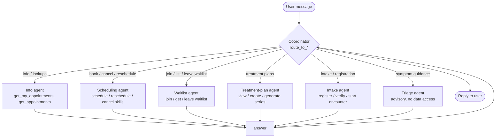
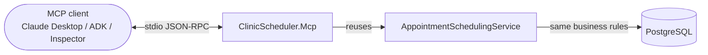

# ClinicAgent

**An agentic healthcare workflow platform for outpatient clinics.**

Clinic staff and patients interact in natural language; an LLM **orchestrator** routes each
request to a specialist sub-agent that runs a constrained tool loop against the clinic's real
domain logic — scheduling, patient intake, treatment plans, and triage today, with more
workflows landing as drop-in packs. Built with ASP.NET Core 10, Blazor, EF Core 10, PostgreSQL,
the Google Gemini API, and a standalone Model Context Protocol server.

> **Note on naming.** This project began as the East Texas A&M CSCI-440 (Group 7) capstone
> "ClinicScheduler." **It is no longer a capstone** — it is being built as a real multi-tenant
> SaaS product. The `ClinicScheduler.*` assembly names and the `csci-440-g7` upstream remote are
> legacy; the product direction is documented in [docs/vision.md](docs/vision.md).

---

## Why it's more than a chatbot on a scheduler

The hard part of agentic healthcare is not any single workflow — it is the **orchestration
engine** that routes a natural-language request to the right specialist, runs a bounded tool
loop, and enforces role- and tenant-scoped access. Scheduling is simply the first workflow built
on that engine. New workflows are added by **registering a pack**, never by editing the
orchestrator.

| Capability | How it's built |
|---|---|
| **Multi-agent orchestration** | `OrchestratorAgentService` — a coordinator routes each turn to one specialist sub-agent. |
| **Workflow packs** | Each workflow is a self-registering `IWorkflowPack` (scheduling, treatment-plan, triage, intake). |
| **Agent skills** | Each tool is a self-registering `ISkill` owning its schema + execution; authorization enforced in C#. |
| **Three front doors** | Blazor chat, REST API (JWT), and a standalone MCP server — all over one set of domain services. |
| **Multi-tenancy** | Clinic = tenant; tenant resolved server-side from the authenticated principal, never a caller argument. |
| **Interoperability** | FHIR resource mapping (`IFhirSyncService`) behind a stable internal contract. |
| **Production posture** | Automatic audit logging, at-rest PHI encryption, optimistic concurrency, real DB integration tests. |

Architecture detail: [docs/system-architecture.md](docs/system-architecture.md) ·
Tenant model: [docs/multi-tenancy-design.md](docs/multi-tenancy-design.md) ·
Workflow strategy: [docs/multi-workflow-strategy.md](docs/multi-workflow-strategy.md).

## 🤝 Multi-agent orchestration

The chat is served by a **multi-agent orchestrator** (`OrchestratorAgentService`). A lightweight
**Coordinator** classifies each request and delegates it to exactly one **specialist sub-agent**,
each with its own system prompt and a *restricted* set of skills. Specialists come from the
registered **workflow packs** — the coordinator routes across the specialists of all of them.



- The Coordinator's *tools are the specialists* (`route_to_*`). When it routes, the orchestrator
  runs that specialist as a **nested tool loop** over a clean copy of the conversation, then feeds
  the answer back for the Coordinator to relay.
- Each specialist only sees the skills relevant to its job — so the Scheduling agent can't be
  tricked into a read-only role's behavior, and vice-versa.
- Both the Coordinator and the specialists run on the **same** `AgentService.RunLoopAsync`
  primitive, which enforces a tool-call iteration cap to prevent runaway loops.
- **Adding a workflow is registering an `IWorkflowPack`** — its specialists join the roster with
  no edit to the orchestrator. Packs live in `ClinicScheduler.Web/Services/Workflows/`.

### Skills

Each agent tool is a self-registering **`ISkill`** in
`ClinicScheduler.Web/Services/Skills/Implementations/`, owning both its OpenAI-format function
schema and its C# execution logic. They register in DI via `AddClinicSkills()`, and
`SkillExecutor` is a thin dispatcher that routes a tool call to the skill whose name matches —
**there is no central switch to edit**. The prompt-facing description for each tool lives
alongside it as a `SKILL.md` file under `ClinicScheduler.Web/Skills/<skill_name>/`, which
`SkillRegistry` discovers at startup to assemble the system-prompt tool catalog.

```
Services/Skills/Implementations/      Skills/<name>/SKILL.md
  GetMyAppointmentsSkill.cs             get_my_appointments
  CancelMyAppointmentSkill.cs           cancel_my_appointment
  GetAppointmentsSkill.cs               get_appointments
  CancelAnyAppointmentSkill.cs          cancel_any_appointment
  ScheduleAppointmentSkill.cs           schedule_appointment
  RescheduleAppointmentSkill.cs         reschedule_appointment
  Join/Get/LeaveWaitlistSkill.cs        join_waitlist / get_my_waitlist / leave_waitlist
  Get/CreateTreatmentPlan + Generate…   get_my_treatment_plan / create_treatment_plan / generate_plan_appointments
  Register/Verify/StartEncounter…       register_patient / verify_patient_demographics / start_encounter
```

- **Authorization is enforced in C#** (e.g. only Staff/Admin roles can call
  `cancel_any_appointment`), so a misbehaving model cannot escalate privileges.
- This separation lets you adjust how a tool is *described* to the model (the markdown)
  independently from how it is *executed* (the C# code).

## 🔌 MCP Server

Beyond the in-app Gemini agent, the same scheduling capabilities are exposed over the
**Model Context Protocol** by a standalone server, **`ClinicScheduler.Mcp`**. Any MCP-capable
client — Claude Desktop, an ADK agent, or the MCP Inspector — can connect and call:

`list_therapists` · `get_appointments` · `schedule_appointment` · `cancel_appointment`



The MCP tools **reuse the exact domain logic** the web app uses (`AppointmentSchedulingService`
+ EF Core repositories), so operating-hours, conflict, and capacity rules are identical. The
destructive `cancel_appointment` carries the same **code-enforced two-step confirmation**. See
[`ClinicScheduler.Mcp/README.md`](ClinicScheduler/ClinicScheduler.Mcp/README.md) for setup and a
Claude Desktop config snippet.

> Today the MCP server is single-clinic / trusted-operator (stdio). Hardening it for external,
> multi-tenant agent access (HTTP/SSE + OAuth + per-clinic scoped tokens) is a planned step — see
> [docs/multi-tenancy-design.md](docs/multi-tenancy-design.md) §8.

### Guardrails & security

> **Guardrails:** Cancellations are protected by a **code-enforced two-step confirmation**. The
> first call to a cancel tool returns a `CONFIRMATION REQUIRED` preview (with the appointment's
> date/time) instead of cancelling; the appointment is only cancelled when the tool is called
> again with `confirmed=true` after the user agrees. This holds even if the model ignores its
> prompt instructions.
>
> **Tenant isolation:** Each user belongs to a clinic; the tenant is resolved server-side from
> the authenticated principal's `clinic` claim (cookie + JWT), never from a tool argument.
>
> **Time zones:** Appointment times are handled as **clinic-local wall-clock** values — "2 PM"
> books a 2 PM clinic slot, with no time-zone shifting.

---

## Features

- **AI assistant:** natural-language scheduling, cancellation, intake, and querying.
- Schedule, update, cancel, and complete appointments.
- Business-rule enforcement: weekdays only, 8am–5pm window, 30-minute slots (configurable per
  location), max-12 concurrent patients.
- Conflict detection: therapist, room, and patient double-booking prevention.
- Role-based access: Admin, ClinicManager, Therapist, Staff, Patient, Auditor.
- In-app notifications and **immutable automatic audit logging** of all database changes.
- **At-rest encryption** of PHI fields (patient notes/phone, appointment notes, …).
- FHIR resource mapping for Patient, Appointment, Practitioner, Location, and Encounter.
- REST API with OpenAPI/Swagger documentation.
- Blazor interactive UI (Server + WebAssembly hybrid) using MudBlazor; MAUI Blazor Hybrid shell
  for mobile/desktop.

---

## Solution layout

| Project | Target | Role |
|---|---|---|
| `ClinicScheduler.Core` | net10.0 | Domain entities (incl. `Clinic` tenant root), services, interfaces — zero project deps |
| `ClinicScheduler.Infrastructure` | net10.0 | EF Core `ClinicDbContext`, repositories, migrations, audit, encryption, FHIR sync |
| `ClinicScheduler.Web` | net10.0 | ASP.NET Core host: API, Blazor Server, Identity/JWT, orchestrator + packs + skills |
| `ClinicScheduler.Web.Client` | net10.0 | Blazor WebAssembly client |
| `ClinicScheduler.Shared` | net10.0 | Shared Razor pages/components (incl. `AgentChat`) |
| `ClinicScheduler.Mcp` | net10.0 | Standalone Model Context Protocol server (stdio) |
| `ClinicScheduler` (MAUI) | net10.0 | Blazor Hybrid shell (Android/iOS/macOS/Windows) |
| `ClinicScheduler.Core.Tests` / `.Web.Tests` | net10.0 | xUnit · FluentAssertions · Moq · FsCheck · Testcontainers |

---

## Prerequisites

- [.NET 10 SDK](https://dotnet.microsoft.com/download)
- [Docker Desktop](https://www.docker.com/products/docker-desktop/) (for PostgreSQL and the
  Testcontainers integration tests)
- A Google Gemini API key
- Visual Studio 2022 (v17.12+) — optional

---

## Getting started

### Option 1 — Docker (recommended, no local PostgreSQL needed)

1. Create your local environment file from the template and add your Gemini API key:
   ```bash
   cp .env.example .env
   # then edit .env and set GEMINI_API_KEY=your_key_here
   ```
   > `.env` is git-ignored — only `.env.example` is committed, so your key never reaches the repo.
2. Build and run the full stack:
   ```bash
   docker-compose up --build
   ```

The app will be available at `http://localhost:8081`.

> `docker-compose` reads secrets (`GEMINI_API_KEY`, `POSTGRES_PASSWORD`, `SEED_ADMIN_PASSWORD`)
> from `.env`, falling back to the defaults in `.env.example` when unset.

Default demo accounts (seeded on first run, all assigned to the **Default Clinic** tenant):

| Role | Email | Password |
|---|---|---|
| Admin | admin@clinic.com | *(set via `SeedAdmin__Password` env var)* |
| Clinic Manager | manager@clinic.com | *(set via seed configuration)* |
| Patient | patient@clinic.com | *(set via seed configuration)* |

### Option 2 — Local development

1. Start a PostgreSQL instance.
2. Set the connection string and Gemini API key in
   `ClinicScheduler/ClinicScheduler.Web/appsettings.Development.json` or as User Secrets:
   ```json
   {
     "ConnectionStrings": {
       "DefaultConnection": "Host=localhost;Database=clinic_scheduler;Username=postgres;Password=postgres"
     },
     "Gemini": { "ApiKey": "YOUR_API_KEY_HERE", "Model": "gemini-2.5-flash" }
   }
   ```
3. Run the web app:
   ```bash
   dotnet run --project ClinicScheduler/ClinicScheduler.Web
   ```

The database is migrated and seeded automatically on startup.

---

## Running tests

Docker must be running — integration tests spin up a real PostgreSQL container automatically via
Testcontainers.

```bash
# Domain/unit tests (no Docker required)
dotnet test ClinicScheduler/ClinicScheduler.Core.Tests

# Full web suite: unit + Testcontainers integration tests
dotnet test ClinicScheduler/ClinicScheduler.Web.Tests
```

---

## Documentation

- [docs/vision.md](docs/vision.md) — product vision and roadmap
- [docs/system-architecture.md](docs/system-architecture.md) — current architecture (with diagrams)
- [docs/multi-tenancy-design.md](docs/multi-tenancy-design.md) — tenant isolation model + staged plan
- [docs/diagrams/](docs/diagrams/) — architecture, deployment, and database/ER diagrams (Mermaid)

## API overview

All endpoints are under `/api/` and documented at `/swagger` in development. Obtain a JWT for API
clients via `POST /api/auth/token` (email + password) and send it as `Authorization: Bearer …`.
