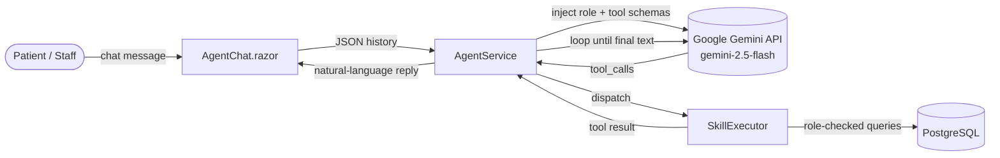
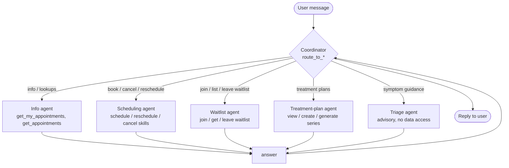

# ClinicScheduler

**Kaggle AI Agents Capstone Project — "Agents for Business" Track**

East Texas A&M CSCI-440 Group 7 capstone — Pain Management Clinic Scheduler.

A web-based scheduling system for managing appointments at a pain management clinic, built with ASP.NET Core 10, Blazor, Entity Framework Core 10, PostgreSQL, and **AI Agents via the Google Gemini API**.

---

## 🎯 Capstone Problem Statement & Solution

**The Problem:** Private and smaller health clinics often face high overhead costs and scheduling inefficiencies. Paying for expensive, monolithic healthcare software with AI capabilities is often out of budget. Furthermore, handling patient appointment requests, cancellations, and business rule validation manually takes up valuable staff time and leads to scheduling conflicts.

**The Solution:** The Clinic Scheduler integrates an intelligent, context-aware AI Concierge Agent designed explicitly for private health clinics. By leveraging the Google Gemini API (`gemini-2.5-flash`), the system provides dynamic, natural language scheduling capabilities that are blazing fast and highly accurate. 

**Why Agents?**
Traditional rule-based chatbots fail to handle the nuanced, natural language requests of patients (e.g., "Can I move my Thursday appointment to next Tuesday morning?"). By using an Agentic approach with **Tools/Skills**, the LLM dynamically understands intent and executes strict C# backend logic (`get_appointments`, `cancel_any_appointment`) to enforce business rules (e.g., maximum 12 concurrent patients, 8am-5pm windows) safely and securely.

### Course concepts demonstrated

| Concept | How this project demonstrates it |
|---|---|
| **Multi-agent system** | A coordinator agent routes each request to a specialist sub-agent (Info / Scheduling / Triage), each with its own prompt and restricted skills — [details below](#-multi-agent-orchestration). |
| **Agent skills** | Filesystem-discovered `SKILL.md` skills (`SkillRegistry` parses frontmatter; `SkillExecutor` runs them) — [details below](#skills-as-markdown). |
| **MCP server** | A standalone Model Context Protocol server (`ClinicScheduler.Mcp`) exposes the scheduling tools to any MCP client (Claude Desktop, ADK, MCP Inspector) — [details below](#-mcp-server). |
| **Security features** | Role-based authorization enforced in C# (not just prompts), code-enforced two-step confirmation for destructive actions, secret hygiene, auth-gated agent endpoint — [details below](#guardrails--security). |
| **Tool use & context injection** *(bonus)* | An OpenAI-style tool-calling loop with the logged-in user's identity and roles injected into the system prompt. |

## 🧠 Agent Architecture

1. **Cloud AI Integration:** The agent is powered by Google's Gemini API, utilizing the OpenAI compatibility endpoint for seamless tool-calling and JSON schema definitions.
2. **Context Injection:** The `.NET AgentService` injects the logged-in user's role (Patient, Admin, Therapist) into the system prompt, ensuring the LLM acts appropriately based on permissions.
3. **Skill Execution:** The LLM receives C# Tool schemas and returns `tool_calls`. The backend `SkillExecutor` runs the code against the PostgreSQL database and returns the result to the LLM for a final natural language response.

### Request Flow



The loop repeats: the model may call several tools in sequence (e.g. `get_my_appointments` → `cancel_my_appointment`) before producing its final answer.

## 🤝 Multi-agent orchestration

The chat is served by a **multi-agent orchestrator** (`OrchestratorAgentService`). A lightweight
**Coordinator** classifies each request and delegates it to exactly one **specialist sub-agent**,
each with its own system prompt and a *restricted* set of skills:



- The Coordinator's *tools are the specialists* (`route_to_info_agent`, `route_to_scheduling_agent`,
  `route_to_triage_agent`). When it routes, the orchestrator runs that specialist as a **nested tool
  loop** over a clean copy of the conversation, then feeds the answer back for the Coordinator to relay.
- Each specialist only sees the skills relevant to its job — so the Scheduling agent can't be tricked
  into a read-only role's behavior, and vice-versa. Adding a new clinic workflow is as simple as adding
  a `SpecialistAgent` to the roster.
- Both the Coordinator and the specialists run on the **same** `AgentService.RunLoopAsync` primitive
  (which also enforces a tool-call iteration cap to prevent runaway loops).

### Skills as Markdown

Each tool is defined as a self-contained `SKILL.md` file under
`ClinicScheduler.Web/Skills/<skill_name>/`, inspired by the agent-skills pattern:

```
Skills/
├── get_my_appointments/SKILL.md      # patient: view own schedule
├── cancel_my_appointment/SKILL.md    # patient: cancel own appointment
├── get_appointments/SKILL.md         # staff/admin: look up any patient
├── cancel_any_appointment/SKILL.md   # staff/admin: cancel any appointment
├── schedule_appointment/SKILL.md     # book a new appointment
├── reschedule_appointment/SKILL.md   # composite: book new slot, then cancel old
├── join_waitlist/SKILL.md            # join the waitlist for a date window
├── get_my_waitlist/SKILL.md          # list own active waitlist entries
├── leave_waitlist/SKILL.md           # remove a waitlist entry
├── get_my_treatment_plan/SKILL.md    # view a patient's treatment plan
├── create_treatment_plan/SKILL.md    # staff: create a treatment plan
└── generate_plan_appointments/SKILL.md  # staff: book the recurring session series
```

- **`SkillRegistry`** discovers every `SKILL.md` at startup, parses its YAML frontmatter (`name`, `description`) and instruction body, and assembles the system-prompt tool catalog.
- **`SkillExecutor`** holds the matching JSON tool schema and the C# implementation for each skill. **Authorization is enforced in C#** (e.g. only Staff/Admin roles can call `cancel_any_appointment`), so a misbehaving model cannot escalate privileges.

This separation lets you adjust how a tool is *described* to the model (the markdown) independently from how it is *executed* (the C# code).

## 🔌 MCP Server

Beyond the in-app Gemini agent, the same scheduling capabilities are exposed over the
**Model Context Protocol** by a standalone server, **`ClinicScheduler.Mcp`**. Any MCP-capable
client — Claude Desktop, an ADK agent, or the MCP Inspector — can connect and call:

`list_therapists` · `get_appointments` · `schedule_appointment` · `cancel_appointment`


The MCP tools **reuse the exact domain logic** the web app uses (`AppointmentSchedulingService`
+ EF Core repositories), so operating-hours, conflict, and capacity rules are identical. The
destructive `cancel_appointment` carries the same **code-enforced two-step confirmation**. See
[`ClinicScheduler.Mcp/README.md`](ClinicScheduler/ClinicScheduler.Mcp/README.md) for setup and a
Claude Desktop config snippet.

### Guardrails & security

> **Guardrails:** Cancellations are protected by a **code-enforced two-step
> confirmation**. The first call to a cancel tool returns a `CONFIRMATION REQUIRED`
> preview (with the appointment's date/time) instead of cancelling; the appointment is
> only cancelled when the tool is called again with `confirmed=true` after the user
> agrees. This holds even if the model ignores its prompt instructions.
>
> **Time zones:** Appointment times are handled as **clinic-local wall-clock** values —
> "2 PM" books a 2 PM clinic slot, with no time-zone shifting. The agent presents times
> with a configurable label (`Clinic:TimeZoneLabel`, default *"clinic time"*) rather than
> raw UTC.

---

## Features

- **AI Assistant:** Natural language appointment scheduling, cancellation, and querying.
- Schedule, update, cancel, and complete appointments.
- Business rule enforcement: weekdays only, 8am–5pm window, 30-minute slots, max 12 concurrent patients.
- Conflict detection: therapist, room, and patient double-booking prevention.
- Role-based access: Admin, ClinicManager, Therapist, Staff, Patient.
- In-app notifications and audit logging.
- **HIPAA Compliance Readiness:** Role-based access control (Admin, ClinicManager, Therapist, Staff, Patient), immutable automatic audit logging of all database changes, and secure telemetry.
- **Accessibility & SEO:** Achieves 100/100 Lighthouse scores for Accessibility and SEO, ensuring WCAG AA compliance via proper ARIA labeling, semantic HTML, and high-contrast UI.
- REST API with OpenAPI/Swagger documentation.
- Blazor interactive UI (Server + WebAssembly hybrid) using MudBlazor.

---

## Prerequisites

- [.NET 10 SDK](https://dotnet.microsoft.com/download)
- [Docker Desktop](https://www.docker.com/products/docker-desktop/) (for PostgreSQL and full-stack Docker run)
- A Google Gemini API Key
- Visual Studio 2022 (v17.12+)

---

## Getting Started

### Option 1 — Docker (recommended, no local PostgreSQL needed)

1. Create your local environment file from the template and add your Gemini API key:
   ```bash
   cp .env.example .env
   # then edit .env and set GEMINI_API_KEY=your_key_here
   ```
   > `.env` is git-ignored — only `.env.example` is committed, so your key never reaches the repo.
2. Build and run the full stack:
   ```bash
   docker-compose up --build
   ```

The app will be available at `http://localhost:8081`.

> **Credentials:** `docker-compose` reads secrets (`GEMINI_API_KEY`, `POSTGRES_PASSWORD`, `SEED_ADMIN_PASSWORD`) from `.env`, falling back to the defaults in `.env.example` when unset.

Default demo accounts (seeded on first run):

| Role | Email | Password |
|---|---|---|
| Admin | admin@clinic.com | *(set via `SeedAdmin__Password` env var)* |
| Clinic Manager | manager@clinic.com | *(set via seed configuration)* |
| Patient | patient@clinic.com | *(set via seed configuration)* |

### Option 2 — Local development

1. Start a PostgreSQL instance.
2. Set the connection string and Gemini API key in `ClinicScheduler/ClinicScheduler.Web/appsettings.Development.json` or as User Secrets:
   ```json
   {
     "ConnectionStrings": {
       "DefaultConnection": "Host=localhost;Database=clinic_scheduler;Username=postgres;Password=postgres"
     },
     "Gemini": {
       "ApiKey": "YOUR_API_KEY_HERE",
       "Model": "gemini-2.5-flash"
     }
   }
   ```
3. Run the web app:
   ```bash
   dotnet run --project ClinicScheduler/ClinicScheduler.Web
   ```

---

## Running Tests

Docker must be running — integration tests spin up a real `postgres:17-alpine` container automatically via Testcontainers.

```bash
# Full web test suite
dotnet test ClinicScheduler/ClinicScheduler.Web.Tests
```

---

## API Overview

All endpoints are under `/api/` and documented at `/swagger` in development.
