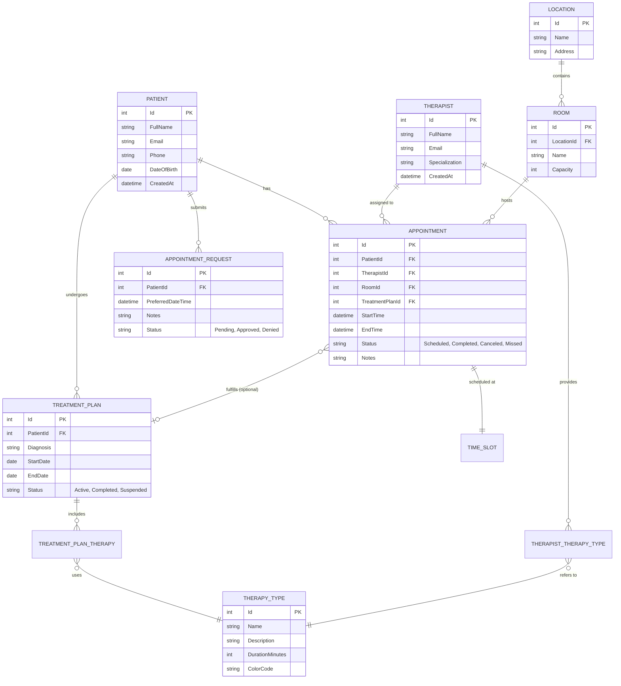

# Database Schema — ClinicScheduler

> Paste into [mermaid.live](https://mermaid.live) to export as PNG/SVG for slides.

```mermaid
erDiagram
    PATIENT ||--o{ APPOINTMENT : "has"
    PATIENT ||--o{ TREATMENT_PLAN : "undergoes"
    PATIENT ||--o{ APPOINTMENT_REQUEST : "submits"
    
    THERAPIST ||--o{ APPOINTMENT : "assigned to"
    THERAPIST ||--o{ THERAPIST_THERAPY_TYPE : "provides"
    
    LOCATION ||--o{ ROOM : "contains"
    ROOM ||--o{ APPOINTMENT : "hosts"
    
    TREATMENT_PLAN ||--o{ TREATMENT_PLAN_THERAPY : "includes"
    TREATMENT_PLAN_THERAPY }o--|| THERAPY_TYPE : "uses"
    THERAPIST_THERAPY_TYPE }o--|| THERAPY_TYPE : "refers to"
    
    APPOINTMENT ||--|| TIME_SLOT : "scheduled at"
    APPOINTMENT }o--o| TREATMENT_PLAN : "fulfills (optional)"

    PATIENT {
        int Id PK
        string FullName
        string Email
        string Phone
        date DateOfBirth
        datetime CreatedAt
    }

    THERAPIST {
        int Id PK
        string FullName
        string Email
        string Specialization
        datetime CreatedAt
    }

    LOCATION {
        int Id PK
        string Name
        string Address
    }

    ROOM {
        int Id PK
        int LocationId FK
        string Name
        int Capacity
    }

    APPOINTMENT {
        int Id PK
        int PatientId FK
        int TherapistId FK
        int RoomId FK
        int TreatmentPlanId FK
        datetime StartTime
        datetime EndTime
        string Status "Scheduled, Completed, Canceled, Missed"
        string Notes
    }

    TREATMENT_PLAN {
        int Id PK
        int PatientId FK
        string Diagnosis
        date StartDate
        date EndDate
        string Status "Active, Completed, Suspended"
    }

    THERAPY_TYPE {
        int Id PK
        string Name
        string Description
        int DurationMinutes
        string ColorCode
    }

    APPOINTMENT_REQUEST {
        int Id PK
        int PatientId FK
        datetime PreferredDateTime
        string Notes
        string Status "Pending, Approved, Denied"
    }
```
