# Database / ER Diagram — ClinicAgent

> Source of truth: `ClinicDbContextModelSnapshot.cs` (EF Core 10, PostgreSQL).
> Paste into [mermaid.live](https://mermaid.live) to export as PNG/SVG for slides.
>
> **No longer a capstone** — this reflects the multi-tenant product schema. `CLINIC` is the
> tenant root. Today only `APP_USER.ClinicId` is a physical FK; **stage 2 of
> [multi-tenancy-design.md](../multi-tenancy-design.md) adds `ClinicId` to every domain table**
> below. Attributes are trimmed to keys + salient fields so the diagram renders everywhere;
> full column/constraint detail is in the notes.

```mermaid
erDiagram
    CLINIC ||--o{ APP_USER : "has users"
    APP_USER ||--o{ NOTIFICATION : "receives (UserId)"
    APP_USER ||--o{ AUDIT_LOG : "acts (UserId)"

    PATIENT ||--o{ APPOINTMENT : "has"
    PATIENT ||--o{ TREATMENT_PLAN : "undergoes"
    PATIENT ||--o{ APPOINTMENT_REQUEST : "submits"
    PATIENT ||--o{ CANCEL_APPOINTMENT_REQUEST : "requests cancel"
    PATIENT ||--o{ WAITLIST_ENTRY : "waits on"
    PATIENT ||--o{ ENCOUNTER : "visits"

    THERAPIST ||--o{ APPOINTMENT : "assigned to"
    THERAPIST ||--o{ TREATMENT_PLAN : "leads"
    THERAPIST ||--o{ THERAPIST_SHIFT : "works"
    THERAPIST }o--o| APPOINTMENT_REQUEST : "preferred by"
    THERAPIST }o--o| WAITLIST_ENTRY : "preferred by"
    THERAPIST }o--o| ENCOUNTER : "seen by"

    LOCATION ||--o{ ROOM : "contains"
    LOCATION ||--o{ TIME_SLOT : "operating hours"
    LOCATION ||--o{ THERAPIST_SHIFT : "hosts"
    LOCATION }o--o| ENCOUNTER : "at"
    LOCATION }o--o| WAITLIST_ENTRY : "preferred at"

    ROOM ||--o{ APPOINTMENT : "hosts"

    THERAPY_TYPE ||--o{ TREATMENT_PLAN_THERAPY : "categorizes"
    THERAPY_TYPE }o--o| APPOINTMENT : "typed as"
    TREATMENT_PLAN ||--o{ TREATMENT_PLAN_THERAPY : "includes"
    TREATMENT_PLAN }o--o| APPOINTMENT : "fulfilled by"

    APPOINTMENT ||--o{ SCHEDULE_CONFLICT : "may have"
    APPOINTMENT }o--o| APPOINTMENT_REQUEST : "results in"
    APPOINTMENT ||--o{ CANCEL_APPOINTMENT_REQUEST : "cancelled via"
    APPOINTMENT }o--o| WAITLIST_ENTRY : "fulfills"
    APPOINTMENT }o--o| NOTIFICATION : "about"

    CLINIC {
        int Id PK
        string Slug UK
        bool IsActive
    }
    APP_USER {
        string Id PK
        int ClinicId FK "tenant"
        string Roles
    }
    PATIENT {
        int Id PK
        string Email UK
        date DateOfBirth
        string FhirId
    }
    THERAPIST {
        int Id PK
        string Email UK
        string NpiNumber UK
        string FhirId
    }
    LOCATION {
        int Id PK
        string Name
        int DailyCapacity
        string FhirId
    }
    ROOM {
        int Id PK
        int LocationId FK
        int Capacity
    }
    THERAPY_TYPE {
        int Id PK
        string Name
    }
    APPOINTMENT {
        int Id PK
        int PatientId FK
        int TherapistId FK
        int RoomId FK
        int TherapyTypeId FK
        int TreatmentPlanId FK
        int Status
        string FhirId
    }
    TREATMENT_PLAN {
        int Id PK
        int PatientId FK
        int TherapistId FK
        int FrequencyPerWeek
        int TotalDays
        int Status
    }
    TREATMENT_PLAN_THERAPY {
        int TreatmentPlanId PK,FK
        int TherapyTypeId PK,FK
    }
    TIME_SLOT {
        int Id PK
        int LocationId FK
        int DayOfWeek
    }
    THERAPIST_SHIFT {
        int Id PK
        int TherapistId FK
        int LocationId FK
    }
    SCHEDULE_CONFLICT {
        int Id PK
        int AppointmentId FK
        bool Resolved
    }
    APPOINTMENT_REQUEST {
        int Id PK
        int PatientId FK
        int PreferredTherapistId FK
        int AppointmentId FK
        int Status
    }
    CANCEL_APPOINTMENT_REQUEST {
        int Id PK
        int AppointmentId FK
        int PatientId FK
        int Status
    }
    WAITLIST_ENTRY {
        int Id PK
        int PatientId FK
        int TherapistId FK
        int LocationId FK
        int FulfilledAppointmentId FK
        int Status
    }
    ENCOUNTER {
        int Id PK
        int PatientId FK
        int TherapistId FK
        int LocationId FK
        int Status
        string FhirId
    }
    NOTIFICATION {
        int Id PK
        string UserId
        int RelatedAppointmentId FK
        bool IsRead
    }
    AUDIT_LOG {
        int Id PK
        string EntityName
        int Action
        string UserId
    }
```

## Notes & detail not shown on the diagram

- **Tenant scope (stage 2):** every domain table (`PATIENT`, `THERAPIST`, `LOCATION`,
  `APPOINTMENT`, `TREATMENT_PLAN`, `ENCOUNTER`, …) gains a `ClinicId FK → CLINIC` plus an EF
  global query filter and insert auto-stamp. Unique indexes `PATIENT.Email`, `THERAPIST.Email`,
  `THERAPIST.NpiNumber` become composite `(ClinicId, …)`. See
  [multi-tenancy-design.md](../multi-tenancy-design.md).
- **Encryption at rest** (DataProtection value converter): `PATIENT.Notes`, `PATIENT.Phone`,
  `APPOINTMENT.Notes`, `APPOINTMENT_REQUEST.Notes`, `WAITLIST_ENTRY.Notes`.
- **Check constraints:** `TREATMENT_PLAN.FrequencyPerWeek ∈ {2,3,4}`,
  `TREATMENT_PLAN.TotalDays ∈ {20,30,50}`, `LOCATION.SlotDurationMinutes BETWEEN 5 AND 240`.
- **Status enums:** `APPOINTMENT.Status` = Scheduled / Completed / Canceled / Missed ·
  `TREATMENT_PLAN.Status` = Active / Completed / Suspended ·
  `APPOINTMENT_REQUEST.Status` = Pending / Approved / Denied · `AUDIT_LOG.Action` =
  Created / Modified / Deleted.
- **Concurrency:** `APPOINTMENT`, `PATIENT`, `THERAPIST`, `TREATMENT_PLAN` carry a PostgreSQL
  `xmin` row-version token. All entities have `CreatedAt` / `UpdatedAt` (auto-stamped on save).
- **Identity tables:** standard ASP.NET `AspNetRoles/UserRoles/UserClaims/...` exist around
  `APP_USER` and are omitted for clarity.
- **Logical links:** `NOTIFICATION.UserId` / `AUDIT_LOG.UserId` reference `APP_USER` by id but
  are **not** enforced FKs (audit/notification must survive user deletion).
- **FHIR:** `FhirId` on Patient, Therapist, Location, Appointment, Encounter holds the remote
  resource id set by `IFhirSyncService` after an EHR sync.
