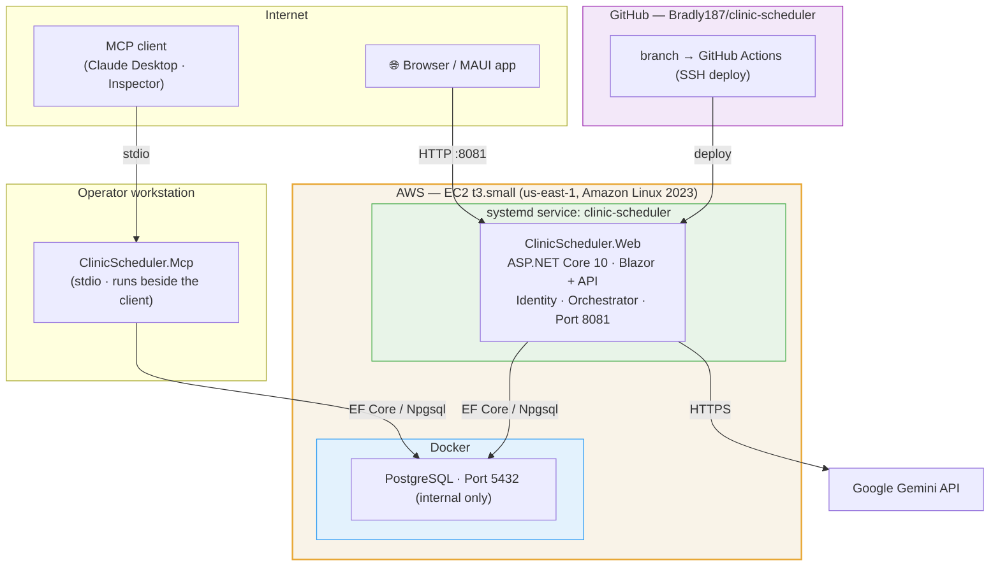
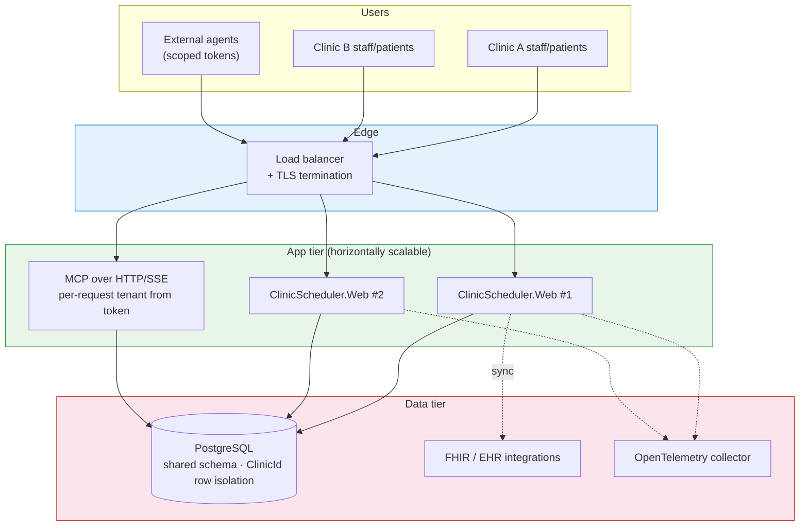

# Deployment Architecture — ClinicAgent

> Paste into [mermaid.live](https://mermaid.live) to export as PNG/SVG for slides.
>
> **No longer a capstone.** The **current** topology is the single-box demo/dev deployment
> inherited from the capstone era. The **target** topology is the multi-tenant SaaS shape the
> product is moving toward — shown separately so the two aren't confused.

## Current (single-box demo / dev)

### Current details
- .NET app runs **natively** under systemd (not containerized); only PostgreSQL runs in Docker.
- Port 5432 is internal to the Docker network — not publicly exposed.
- The MCP server is a **stdio** process that runs next to the MCP client (single-clinic/trusted
  operator); it is not part of the web deploy.
- HTTPS termination deferred (no load balancer / Nginx yet); secrets come from a non-committed
  `.env`.

## Target (multi-tenant SaaS)

### Target notes (not yet built)
- **Tenant isolation** is enforced by EF global query filters keyed on the `clinic` claim
  (stages 2–3 of [../multi-tenancy-design.md](../multi-tenancy-design.md)); the shared database
  uses row-level `ClinicId` scoping, with the option to promote a noisy/regulated tenant to its
  own database without app changes.
- **MCP for external agents** moves from stdio to HTTP/SSE with OAuth and per-clinic scoped
  tokens; tenant is resolved per request, never as a tool argument.
- App tier scales horizontally behind the load balancer; TLS terminates at the edge.
