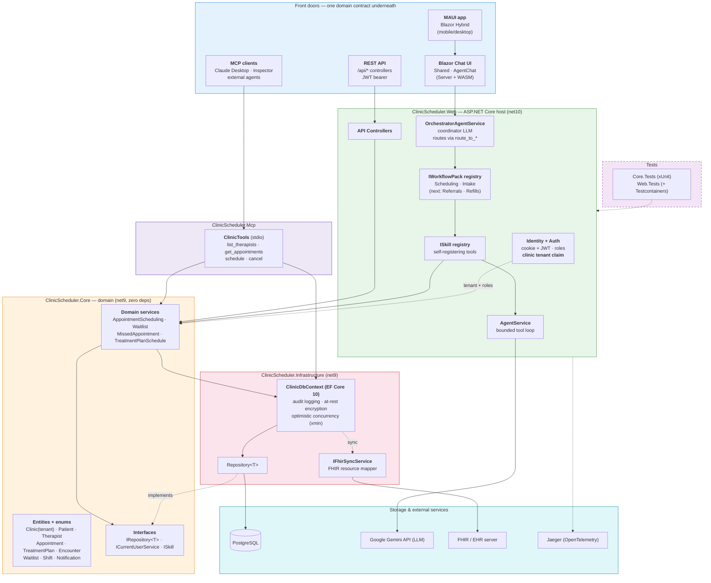

# System Architecture — ClinicAgent

> Paste into [mermaid.live](https://mermaid.live) to export as PNG/SVG for slides.
> Prose walkthrough: [../system-architecture.md](../system-architecture.md).
>
> **No longer a capstone** — multi-tenant agentic healthcare platform. Assemblies keep the
> legacy `ClinicScheduler.*` names.

## How to read it

- **Three front doors, one contract.** Chat (orchestrator), REST API (controllers), and the
  standalone MCP server all invoke the **same Core domain services**, so business rules
  (operating hours, slot alignment, conflicts, capacity, two-step cancel) are enforced identically.
- **Dependencies point inward.** `Core` has zero project references; `Infrastructure` depends only
  on `Core`; hosts depend on the inner layers. `Repository<T>` and `ICurrentUserService` are
  Core-defined contracts fulfilled by outer layers (dependency inversion).
- **AI is pluggable.** The orchestrator routes to specialists supplied by registered
  `IWorkflowPack`s; each tool is a self-registering `ISkill`. Adding a workflow registers a pack —
  no orchestrator edits.
- **Tenant is ambient, not an argument.** `Identity` resolves the clinic from the principal's
  `clinic` claim and feeds it to the data layer (dotted line) — never passed by a caller.

## Key design decisions

| Decision | Rationale |
|---|---|
| Business rules in `Core`, not controllers/tools | Channels stay thin; one rule set, testable without HTTP |
| `IRepository<T>` / `ICurrentUserService` in Core | Dependency inversion — Core defines contracts, Infrastructure fulfills |
| Workflow packs + self-registering skills | New workflows are drop-in; no central switch or orchestrator edits |
| Tenant from identity claim, enforced at data layer | The model never decides which clinic it can touch |
| FHIR behind an adapter | EHR/vendor changes don't ripple into tool or agent schemas |
| Testcontainers for integration tests | Real PostgreSQL catches SQL/EF issues mocks miss |
