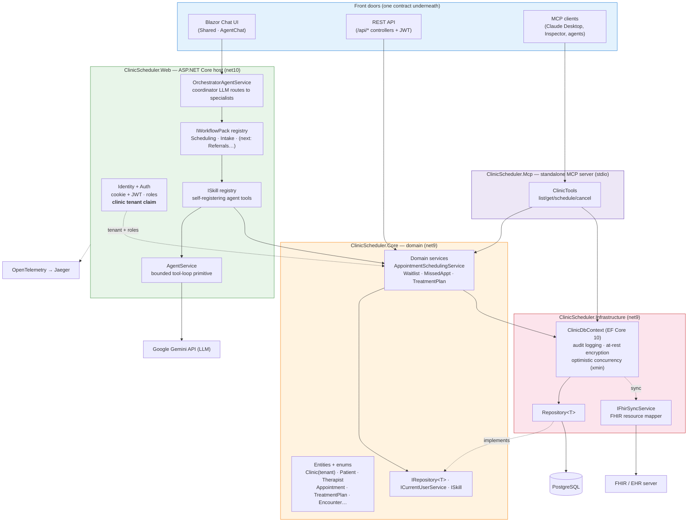
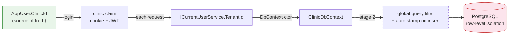

# ClinicAgent — System Architecture

**Status:** Active · **Date:** 2026-06-30 · **Owner:** Brad Tarver

> **No longer a capstone project.** Assemblies are still named `ClinicScheduler.*` for legacy
> reasons (see [vision.md](vision.md)); the system described here is a multi-tenant agentic
> healthcare platform. For the older layered-projects reference, see [architecture.md](architecture.md).

---

## 1. The big picture

ClinicAgent is a Clean-Architecture .NET solution with three front doors into one set of
domain services, an LLM orchestration engine that hosts pluggable **workflow packs**, and a
FHIR adapter for EHR interoperability. Tenant (clinic) context is resolved server-side from
identity and enforced at the data layer.

## 2. Projects

| Project | Target | Responsibility |
|---|---|---|
| **Core** | net9.0 | Domain entities (incl. `Clinic` tenant root), enums, domain services, interfaces (`IRepository<T>`, `ICurrentUserService`, `ISkill`), auth claim types. Zero project dependencies. |
| **Infrastructure** | net9.0 | `ClinicDbContext` (EF Core 10 + Identity), `Repository<T>`, migrations, automatic audit logging, at-rest encryption, `IFhirSyncService` + FHIR resource mapper. |
| **Web** | net10.0 | ASP.NET Core host: REST API, Blazor Server, Identity/JWT auth, DI, the orchestrator + workflow packs + skills, OpenTelemetry. |
| **Web.Client** | net10.0 | Blazor WebAssembly entry point for interactive components. |
| **Shared** | net10.0 | Razor pages/components (incl. `AgentChat`) shared by Web and MAUI. |
| **Mcp** | net10.0 | Standalone Model Context Protocol server (stdio) exposing scheduling tools to any MCP client, reusing Core/Infrastructure so business rules match. |
| **MAUI** | net10.0 | Blazor Hybrid shell (Android/iOS/macOS/Windows) hosting Shared UI. |
| **Core.Tests / Web.Tests** | net10.0 | xUnit + FluentAssertions + Moq; Web.Tests adds Testcontainers + WebApplicationFactory integration tests against real PostgreSQL. |

## 3. Multi-tenancy (clinic = tenant)

Tenant context flows one direction — from identity down to the query — and is **never** a
caller-supplied argument:

- **Shipped (stages 0–1):** `Clinic` tenant root; `AppUser.ClinicId`; the `clinic` claim emitted
  on both the Identity cookie and the API JWT; `ICurrentUserService.TenantId`.
- **Planned (stages 2–3):** `ClinicId` on every tenant-owned entity, EF global query filters +
  insert auto-stamp, composite unique indexes, and fixed-tenant wiring for the MCP server.

Full design and rollout: [multi-tenancy-design.md](multi-tenancy-design.md).

## 4. The orchestration engine & workflow packs

- **`OrchestratorAgentService`** — a coordinator LLM that routes each chat turn to one specialist
  sub-agent (Info / Scheduling / Triage / Intake…) via `route_to_*` tools.
- **`IWorkflowPack`** — a drop-in unit bundling a workflow's specialists, skills, and domain
  mapping. The orchestrator builds its roster from all registered packs; adding a workflow never
  edits the orchestrator. Registered via `AddClinicWorkflows()`.
- **`ISkill`** — each agent tool self-registers into the skill registry (`AddClinicSkills()`),
  replacing the old central `switch`. Skills invoke domain services, so rules are enforced
  identically regardless of channel.
- **`AgentService.RunLoopAsync`** — the shared, bounded tool-loop primitive powering both single-
  and multi-agent flows.

Strategy and staged refactor history: [multi-workflow-strategy.md](multi-workflow-strategy.md).

## 5. Interoperability (FHIR)

`IFhirSyncService` plus a resource mapper translate ClinicAgent entities to FHIR resources
(Patient, Appointment, Practitioner, Location, Encounter), keyed by a `FhirId` carried on each
mapped entity. EHR/vendor specifics stay behind this adapter so tool and agent contracts remain
stable as FHIR coverage grows.

## 6. Cross-cutting production concerns

| Concern | Mechanism |
|---|---|
| **Audit trail** | `ClinicDbContext.SaveChangesAsync` writes an `AuditLog` row for every Added/Modified/Deleted entity; sensitive fields redacted. |
| **PII/PHI at rest** | `IDataProtectionProvider`-backed value converters encrypt `Patient.Notes/Phone`, `Appointment.Notes`, etc. |
| **Concurrency** | PostgreSQL `xmin` row-version tokens on Appointment, Patient, Therapist, TreatmentPlan. |
| **AuthZ** | ASP.NET Identity roles (Staff/Admin gate sensitive operations); JWT for API clients; tenant claim scopes data. |
| **Observability** | OpenTelemetry traces (ASP.NET Core, HttpClient, EF Core, agent sources) → OTLP/Jaeger. |
| **Testing** | Unit tests + Testcontainers integration tests against real PostgreSQL. |

## 7. Technology stack

.NET 10 / ASP.NET Core 10 · Blazor (Server + WASM) · MudBlazor 9 · EF Core 10 · PostgreSQL ·
ASP.NET Core Identity · Google Gemini API · Model Context Protocol SDK · OpenTelemetry + Jaeger ·
.NET MAUI Blazor Hybrid · xUnit/FluentAssertions/Moq/Testcontainers · Docker.

## 8. Diagrams

- [diagrams/system-architecture.md](diagrams/system-architecture.md) — component/container view.
- [diagrams/database-schema.md](diagrams/database-schema.md) — full ER / database diagram.
- [diagrams/deployment-architecture.md](diagrams/deployment-architecture.md) — current + target topology.
